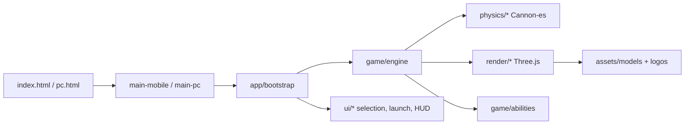

# Bey Web (Classic)

**Bey Web** is a browser-native Beyblade stadium fighter: pick a Metal Fusion bey, rip into a 3D arena, and win by ring-out or spin-out. Built for fans who want that anime clash feel without installs - gyro on mobile, keyboard local 2-player on PC, and CPU tournament / casual modes either way.

**Live demo:** https://lakshmanchelliah.github.io/BeyWeb-classic/

> Offline classic snapshot of [BeyWeb](https://github.com/LakshmanChelliah/BeyWeb) (pre-multiplayer). No server required.

## Features

- **8 playable beys** with GLB models, logos, and unique power / special kits
- **Casual vs CPU** and **Tournament** campaign with per-rival arena skins
- **PC local 2-player** (WASD + Q/E · arrows + N/M)
- **Mobile gyro + virtual joystick** with iOS motion-permission handling
- **Let-it-rip launch mini-game** that sets opening spin
- **Anime-leaning VFX** (ability FX, collision sparks, stadium transitions)
- **Static deploy** - vendored Three.js / Cannon-es, GitHub Pages ready

## Tech stack

| Layer | Choice |
|-------|--------|
| Rendering | Three.js (ES modules, vendored) |
| Physics | Cannon-es |
| Particles | three.quarks / quarks.core |
| App shell | Vanilla ES modules (no bundler) |
| Mobile input | DeviceOrientation + touch joystick |
| PC input | Keyboard |
| Asset pipeline | glTF-Transform, meshoptimizer, pngjs (Node scripts) |
| Hosting | GitHub Pages (static) |

## Architecture



Fixed-timestep loop: physics → abilities / contacts → visual sync → camera / VFX.

## Project structure

```
├── index.html / pc.html   # Mobile + PC entrypoints
├── assets/
│   ├── models/            # Runtime GLBs
│   └── logos/             # UI emblems / HUD avatars
├── css/                   # Game styles
├── js/
│   ├── assets.js          # Path helpers (single source of truth)
│   ├── config.js          # Tunable constants
│   ├── app/               # Shared bootstrap / mode wiring
│   ├── game/              # Engine, roster, abilities, campaign
│   ├── physics/           # World, tops, contacts, ring-out
│   ├── render/            # Scene, arena, models, VFX
│   ├── input/             # Gyro, joystick, keyboard, AI
│   ├── ui/                # Selection, launch, overlays
│   └── debug/             # ?capture=1 Playwright hooks
├── vendor/                # Vendored Three.js + quarks + cannon-es
├── pipeline/              # Reference / debug / source meshes (not deployed)
├── scripts/               # Asset bake + Playwright verify helpers
└── docs/                  # Design briefs
```

## Quick start

```bash
npm install          # optional - only needed for asset/pipeline scripts
npm run dev          # http-server on http://127.0.0.1:8000
```

Open **http://127.0.0.1:8000/** (mobile UI; desktops redirect to `pc.html`) or **http://127.0.0.1:8000/pc.html**.

You can also open the HTML files directly, but ES module imports work most reliably via a static server.

## Testing / CI

There is no unit-test runner yet. Smoke checks (Playwright):

```bash
npm install --no-save playwright
npx playwright install chromium
npm run dev          # in another terminal
node scripts/verify-local-site.mjs
node scripts/verify-pc-page.mjs
```

GitHub Actions deploys Pages from `main`, packaging a production `_site` that **excludes** `pipeline/`, `scripts/`, and other tooling.

## Engineering highlights

1. **Declarative bey roster** - stats, models, and ability IDs in one table; the engine resolves loadouts from a registry.
2. **Shared bootstrap** - mobile and PC share mode/campaign/selection wiring; only input adapters differ.
3. **Model cache + orientation fixes** - GLBs preload once; per-bey axis corrections keep spin upright without re-authoring every mesh.
4. **Capture mode** - `?capture=1` exposes a browser API for automated ability VFX frame dumps.
5. **Clean asset layout** - runtime media under `assets/`; bake references stay in `pipeline/` and stay out of the Pages artifact.

## License & disclaimer

Code is provided as-is for portfolio / educational use (`ISC` in `package.json`).

**Beyblade**, character names, and related marks are trademarks of their respective owners (e.g. ADK / Takara Tomy / Hasbro). This is an unofficial fan project and is not affiliated with or endorsed by those companies.

For online multiplayer and newer features, see the main [BeyWeb](https://github.com/LakshmanChelliah/BeyWeb) repo.
